# Java Web 无框架

# 主要内容

> [项目背景](#项目背景)  
> [操作步骤](#操作步骤)

# 正文

## 项目背景

在Java及生态快速发展的今天,我们对于项目的搭建及初始化已经非常方便,很多配置在使用IDE(`IntelliJ IDEA`, `Spring Tools`, 
`Visual Studio Code`, `Eclipse`)或者init工具([Spring Initializr](https://start.spring.io/))就已经完成了,在享受技术包装带来的
便利之时,了解自动配置下的运行原理是非常有必要的.工具经常更新迭代,包装方式各种各样,但底层原理却是基本不变的.打开远古的文件夹,里面是
多年前没有`Maven` `Spring` `MVC框架` `ORM框架`的情况下写的代码.这该如何运行呢?

## 操作步骤

#### 操作前提

本文以 IntelliJ IDEA 2019.3.1 为例

----

#### 项目代码

这个代码结构比较清晰
- lib: 外部引用库
- resources: 资源目录,主要是配置文件
- src: Java源文件
- webapp: 前端文件
- `.classpath` / `.project`: IDE自动生成文件

我们可以把`.classpath`, `.project` **删除**掉,后续将代码从IDE中打开会重新生成

----

这是删除多余文件后的干净的文件目录,然后用IDE打开(open)即可

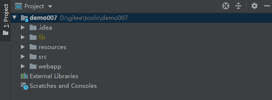

打开后在IDE上显示如上图,原始文件目录都有,还自动生成了`.`开头的文件.

----

#### 项目配置

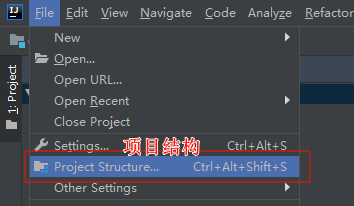

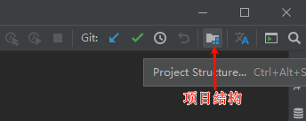

接下来要进行项目结构配置,点击`File -> Project Structure`或者点击`Project Structure`图标都可以.

----

Project Settings: 项目设置
- Project: 项目相关设置
- Modules: 项目中的模块相关设置
- Libraries: 项目中用到的类库相关设置
- Facets：项目特征,确认项目`源码`, `资源`等信息
- Artifacts: 项目成品, 项目打包相关设置

Platform Settings: 平台设置,Java工程里指的是Java平台
- SDKs: 项目使用SDK(Software Development Kit)设置,Java工程中指的是JDK(Java Development Kit)
- Global Libraries: 全局类库设置

Problems: 问题,列出IDE检测出的问题,但并不能检测出所有问题

----

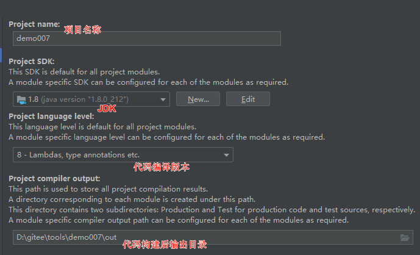

项目相关信息

----

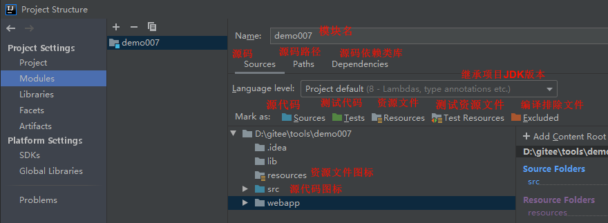

模块相关信息,这页用来配置源码和资源

----

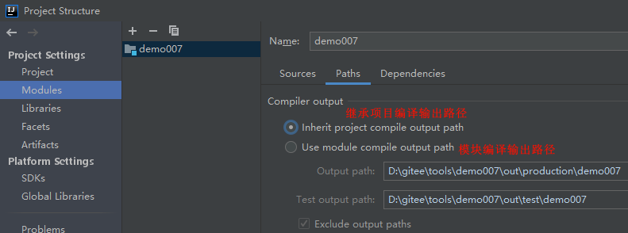

模块相关信息,这页用来配置模块编译后输出路径,这是一个项目一个模块,路径和项目输出路径一致即可.

----

模块相关信息,这页用来配置模块依赖类库,这是一个项目一个模块,就把依赖类库全放在Project Libraries(看下图).

----

项目依赖类库:
- `MySQL JDBC` 实现 `mysql-connector-java-8.0.18.jar`
- `Servlet` 实现 `servlet-api.jar`
- `JSP` 实现 `taglibs-standard-impl-1.2.5.jar`, `taglibs-standard-spec-1.2.5.jar`
- 数据库连接池实现 `druid-1.0.26.jar` 非必须,此处是因为使用了该实现类
- 测试类实现 `junit-4.12.jar` 非必须

----

项目依赖类库添加后,模块便有了此类库.

----

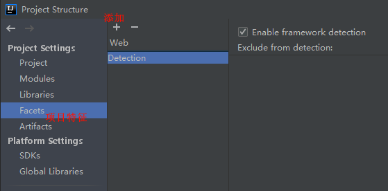

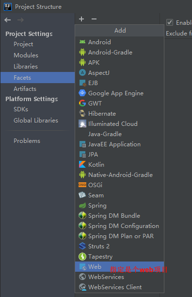

项目特征添加,这是个Web项目.

----

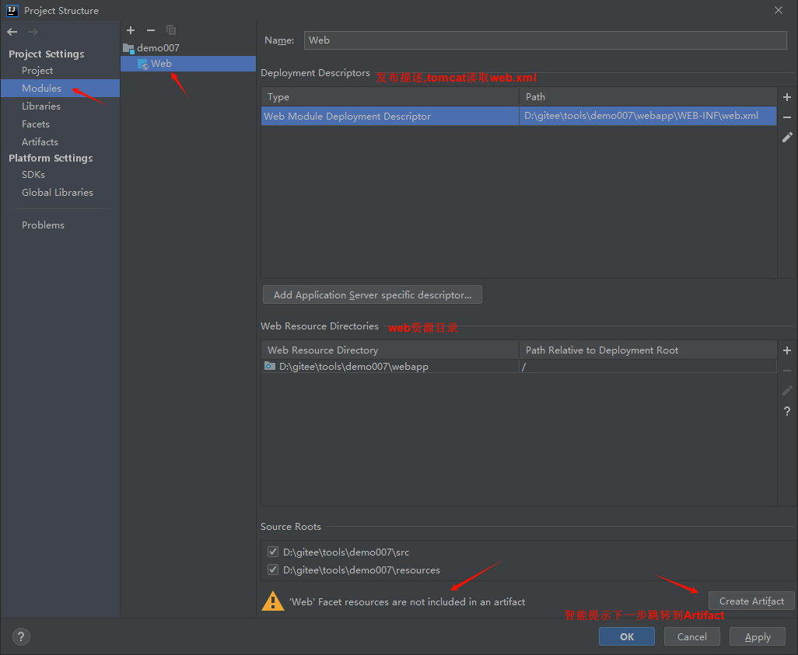

添加web项目要指定web资源目录以及web.xml文件,tomcat服务器需要读取该资源目录及文件.然后根据提示跳转到Artifacts.

----

指定项目构建成品信息,注意要手动创建依赖类库,类库名称和tomcat示例一致(如下图).

----

项目成品目录结构和示例结构一致

----

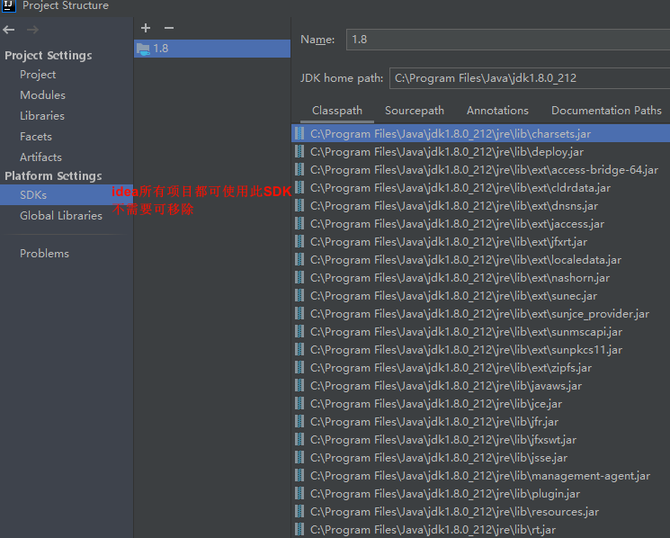

所有项目的SDK

----

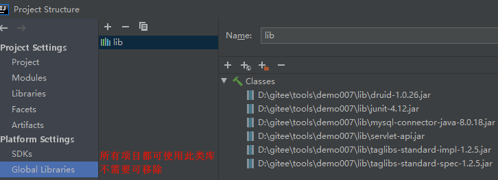

所有项目的类库

----

没有问题就可以点Apply了

----

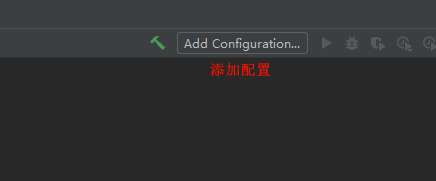

点击添加配置

----

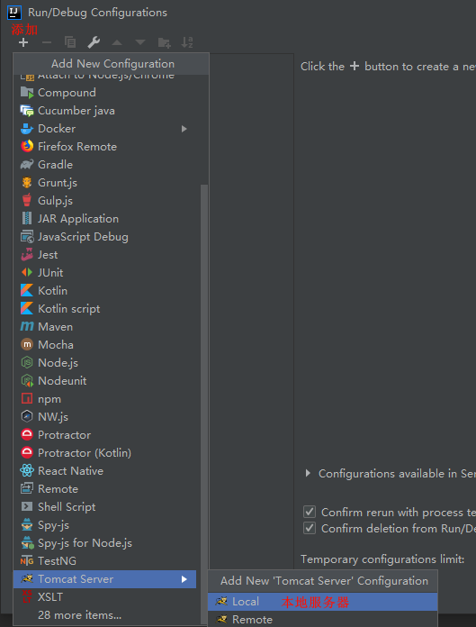

添加Tomcat本地服务器

----

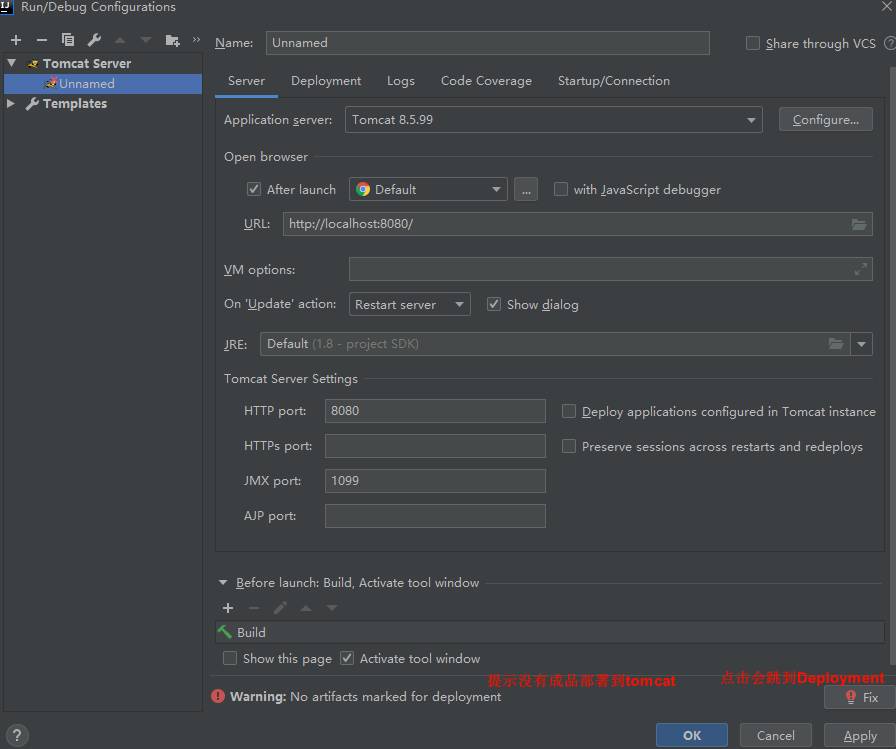

有提示需要配置项目成品

----

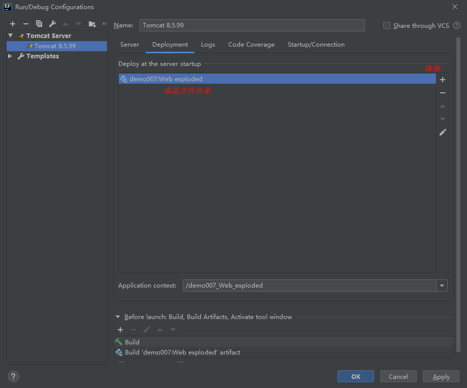

在Deployment页面添加成品目录

----

添加完成品目录后,在底下的Build会看到构建项目成品的脚本,构建时间在tomcat启动前

----

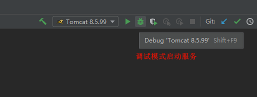

使用调试模式启动服务,也可以用非调试模式,开发阶段一般都需要调试代码.

----

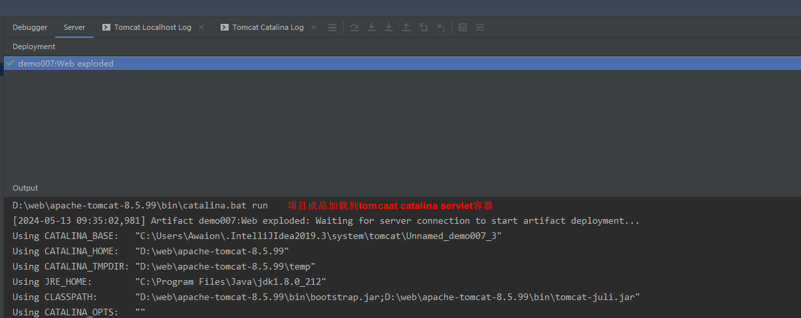

tomcat启动日志,服务器正在加载项目成品目录

----

部署完成

----

浏览器访问接口,正确响应页面和数据

----

### 总结

在没有框架帮助下,我们需要去理解项目是如何根据配置构建的,Tomcat是如何加载的,尝试操作下这种情况能够对IDE,对服务器有更深的理解.

[Github 源码](https://github.com/Awaion/tools/tree/master/demo007)

[返回顶部](#主要内容)

