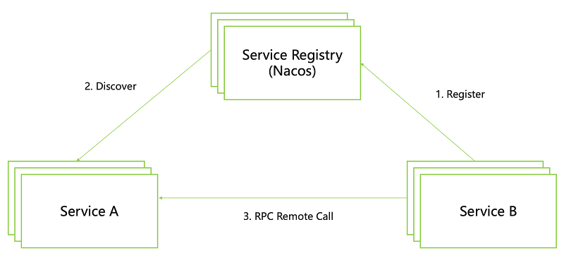
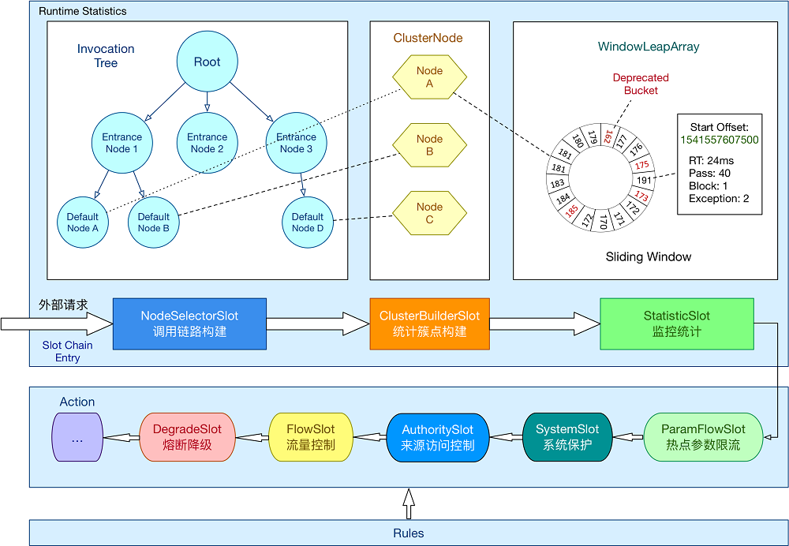
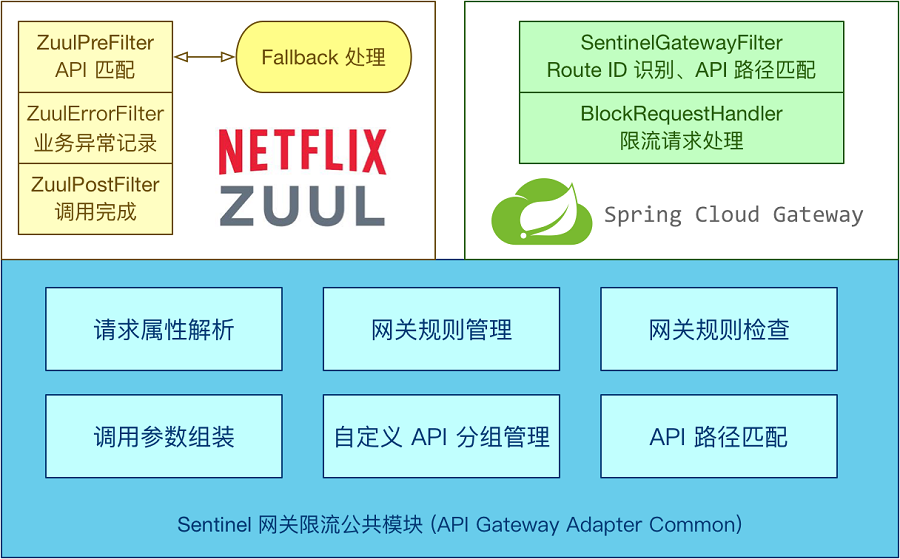
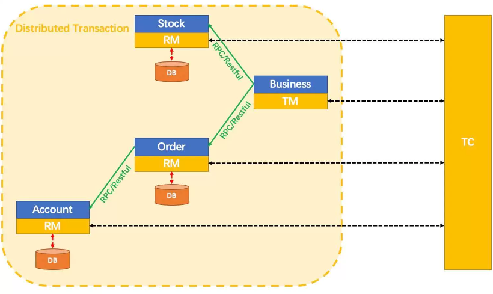
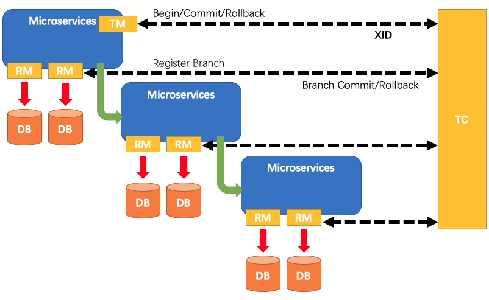

# Spring Cloud Alibaba

# 主要内容

> [Spring Cloud Alibaba](#spring-cloud-alibaba)  
> [注册配置中心 Nacos](#注册配置中心-nacos)  
> [限流降级 Sentinel](#限流降级-sentinel)  
> [网关限流 Gateway + Sentinel]()  
> [分布式事务 Seata](#分布式事务-seata)

## Spring Cloud Alibaba

主要功能

- 服务限流降级:默认支持 WebServlet,WebFlux,OpenFeign,RestTemplate,Spring Cloud Gateway,Dubbo 和 RocketMQ 限流降级功能的接入,
  可以在运行时通过控制台实时修改限流降级规则,还支持查看限流降级 Metrics 监控.
- 服务注册与发现:适配 Spring Cloud 服务注册与发现标准,默认集成对应 Spring Cloud 版本所支持的负载均衡组件的适配.
- 分布式配置管理:支持分布式系统中的外部化配置,配置更改时自动刷新.
- 消息驱动能力:基于 Spring Cloud Stream 为微服务应用构建消息驱动能力.
- 分布式事务:使用 @GlobalTransactional 注解, 高效并且对业务零侵入地解决分布式事务问题.
- 阿里云对象存储:阿里云提供的海量,安全,低成本,高可靠的云存储服务.支持在任何应用,任何时间,任何地点存储和访问任意类型的数据.
- 分布式任务调度:提供秒级,精准,高可靠,高可用的定时(基于 Cron 表达式)任务调度服务.同时提供分布式的任务执行模型,如网格任务.网格任务支持海
  量子任务均匀分配到所有 Worker(schedulerx-client)上执行.
- 阿里云短信服务:覆盖全球的短信服务,友好,高效,智能的互联化通讯能力,帮助企业迅速搭建客户触达通道.

组件

- Sentinel:把流量作为切入点,从流量控制,熔断降级,系统负载保护等多个维度保护服务的稳定性.
- Nacos:一个更易于构建云原生应用的动态服务发现,配置管理和服务管理平台.
- RocketMQ:一款开源的分布式消息系统,基于高可用分布式集群技术,提供低延时的,高可靠的消息发布与订阅服务.
- Seata:阿里巴巴开源产品,一个易于使用的高性能微服务分布式事务解决方案.
- Alibaba Cloud OSS: 阿里云对象存储服务(Object Storage Service,简称 OSS),是阿里云提供的海量,安全,低成本,高可靠的云存储服务.您可以
  在任何应用,任何时间,任何地点存储和访问任意类型的数据.
- Alibaba Cloud SchedulerX: 阿里中间件团队开发的一款分布式任务调度产品,提供秒级,精准,高可靠,高可用的定时(基于 Cron 表达式)任务调度服务.
- Alibaba Cloud SMS: 覆盖全球的短信服务,友好,高效,智能的互联化通讯能力,帮助企业迅速搭建客户触达通道.


更多

- https://spring.io/projects/spring-cloud-alibaba
- https://github.com/alibaba/spring-cloud-alibaba
- https://sca.aliyun.com/

## 注册配置中心 Nacos

Nacos 是 Dynamic Naming and Configuration Service 的首字母简称,一个更易于构建云原生应用的动态服务发现,配置管理和服务管理平台

特性

- 服务发现和服务健康监测
- 动态配置服务
- 动态 DNS 服务
- 服务及其元数据管理

概念

- 服务注册中心 (Service Registry)
- 服务元数据 (Service Metadata)
- 服务提供方 (Service Provider)
- 服务消费方 (Service Consumer)
- 名字服务 (Naming Service)
- 配置服务 (Configuration Service)




服务端启动

```text
# 启动
bin/startup.cmd -m standalone

# 默认地址访问,默认账户/密码:nacos/nacos
http:localhost:8848/nacos
```

更多

- https://sca.aliyun.com/docs/2023/user-guide/nacos/quick-start
- https://nacos.io/zh-cn/docs/quick-start.html
- https://github.com/alibaba/nacos/releases

## 限流降级 Sentinel

Sentinel 是面向分布式,多语言异构化服务架构的流量治理组件,主要以流量为切入点,从流量路由,流量控制,流量整形,熔断降级,系统自适应过载保护,热点流量防
护等多个维度来帮助开发者保障微服务的稳定性

特征

- 丰富的应用场景:Sentinel 承接了阿里巴巴近 10 年的双十一大促流量的核心场景,例如秒杀(即突发流量控制在系统容量可以承受的范围),消息削峰填谷,实时熔断下游不可用应用等.
- 完备的实时监控:Sentinel 同时提供实时的监控功能.您可以在控制台中看到接入应用的单台机器秒级数据，甚至 500 台以下规模的集群的汇总运行情况.
- 广泛的开源生态:Sentinel 提供开箱即用的与其它开源框架/库的整合模块，例如与 Spring Cloud,Dubbo,gRPC 的整合.您只需要引入相应的依赖并进行简单的配置即可快速地接入 Sentinel.
- 完善的 SPI 扩展点:Sentinel 提供简单易用,完善的 SPI 扩展点.您可以通过实现扩展点，快速的定制逻辑.例如定制规则管理,适配数据源等.

原理

- Slot(变量槽)是局部变量表中最基本的存储单元
- 插槽链 slot chain(NodeSelectorSlot,ClusterBuilderSlot,StatisticSlot,FlowSlot,AuthoritySlot,DegradeSlot,SystemSlot)
- ProcessorSlot 作为 SPI 接口进行扩展



服务端启动

```text
# 启动
java -jar sentinel-dashboard-1.8.6.jar
# 登录 sentinel/sentinel
http://localhost:8080/ 
```

关联词汇:服务雪崩,服务降级,服务熔断,服务限流,服务隔离,服务超时

更多

- https://sca.aliyun.com/
- https://github.com/alibaba/Sentinel
- https://sentinelguard.io/zh-cn/docs/introduction.html

## 网关限流 Gateway + Sentinel

原理

- GatewayFlowRule:网关限流规则,针对 API Gateway 的场景定制的限流规则,可以针对不同 route 或自定义的 API 分组进行限流,支持针对请求中的参数,Header,来源 IP 等进行定制化的限流.
- ApiDefinition：用户自定义的 API 定义分组,可以看做是一些 URL 匹配的组合.比如我们可以定义一个 API 叫 my_api,请求 path 模式为 /foo/** 和 /baz/** 的都归到 my_api
  这个 API 分组下面.限流的时候可以针对这个自定义的 API 分组维度进行限流.
- GatewayRuleManager.loadRules(rules) 手动加载网关规则
- GatewayRuleManager.register2Property(property) 注册动态规则源动态推送(推荐方式)
- Sentinel 1.6.3 引入了网关流控控制台的支持,用户可以直接在 Sentinel 控制台上查看 API Gateway 实时的 route 和自定义 API 分组监控,管理网关规则和 API 分组配置.




更多

- https://sentinelguard.io/zh-cn/docs/api-gateway-flow-control.html
- https://github.com/alibaba/Sentinel/wiki/%E7%BD%91%E5%85%B3%E9%99%90%E6%B5%81
- https://github.com/alibaba/Sentinel/tree/master/sentinel-demo/sentinel-demo-spring-cloud-gateway
- https://sentinelguard.io/zh-cn/index.html
- https://github.com/alibaba/Sentinel

## 分布式事务 Seata

Seata(Simple Extensible Autonomous Transaction Architecture)是一款开源的分布式事务解决方案,致力于提供高性能和简单易用的分布式事务服务.
Seata 提供AT,TCC,SAGA,XA事务模式,为用户打造一站式的分布式解决方案.

- TC(Transaction Coordinator)事务协调器
- TM(Transaction Manager)事务管理器
- RM(ResourceManager)资源管理器





AT 模式基于 支持本地 ACID 事务 的 关系型数据库,先获取全局锁+本地消息表

- 一阶段 prepare 行为：在本地事务中，一并提交业务数据更新和相应回滚日志记录。
- 二阶段 commit 行为：马上成功结束，自动 异步批量清理回滚日志。
- 二阶段 rollback 行为：通过回滚日志，自动 生成补偿操作，完成数据回滚。

TCC 模式，不依赖于底层数据资源的事务支持：

- 一阶段 prepare 行为：调用 自定义 的 prepare 逻辑。
- 二阶段 commit 行为：调用 自定义 的 commit 逻辑。
- 二阶段 rollback 行为：调用 自定义 的 rollback 逻辑。

Saga模式是SEATA提供的长事务解决方案,基于状态机引擎来实现的

- 业务流程中每个参与者都提交本地事务，
- 当出现某一个参与者失败则补偿前面已经成功的参与者，一阶段正向服务和二阶段补偿服务都由业务开发实现
- 优势:一阶段提交本地事务，无锁，高性能
- 优势:事件驱动架构，参与者可异步执行，高吞吐
- 优势:补偿服务易于实现
- 缺点:不保证隔离性

XA 规范 是 X/Open 组织定义的分布式事务处理（DTP，Distributed Transaction Processing）标准

- XA 协议要求事务资源本身提供对规范和协议的支持，所以事务资源（如数据库）可以保障从任意视角对数据的访问有效隔离，满足全局数据一致性
- 基于两阶段提交,数据库自身实现
- 业务无侵入
- XA prepare 后，分支事务进入阻塞阶段，收到 XA commit 或 XA rollback 前必须阻塞等待。事务资源长时间得不到释放，锁定周期长，而且在应用层上面无法干预，性能差。

服务端启动

```text
# 启动脚本
bin\seata-server.bat
# 访问地址 seata/seata
http://localhost:7091
```

更多

- https://github.com/alibaba/spring-cloud-alibaba/blob/2023.x/spring-cloud-alibaba-examples/seata-example/readme-zh.md
- https://sca.aliyun.com/docs/2023/user-guide/seata/overview/
- https://seata.apache.org/zh-cn/docs/user/mode/at/
- https://github.com/apache/incubator-seata/releases
- https://github.com/apache/incubator-seata
- https://seata.apache.org/

## 结尾

以上就是本文核心内容.

[Github 源码](https://github.com/Awaion/tools/tree/master/demo029)

[返回顶部](#主要内容)

